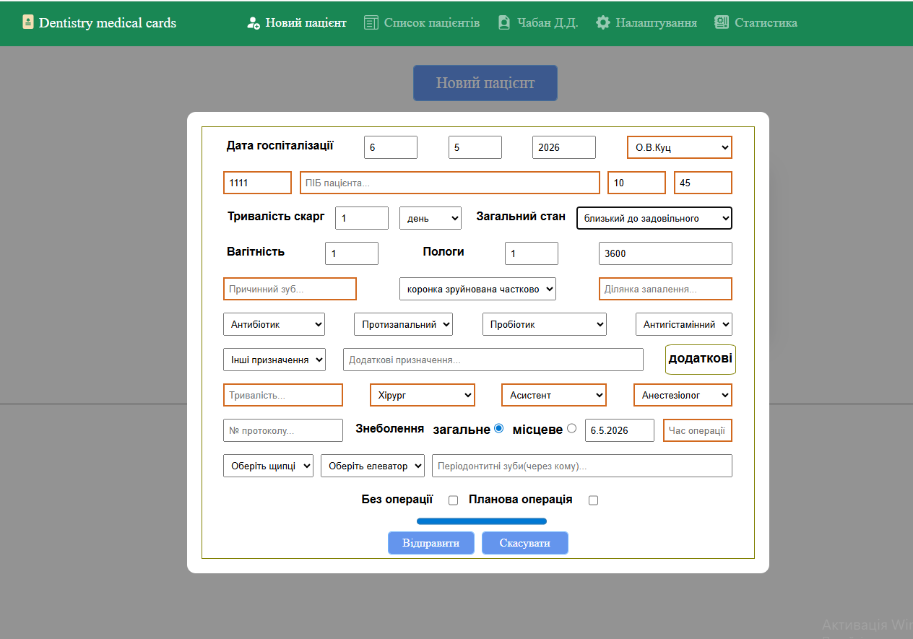
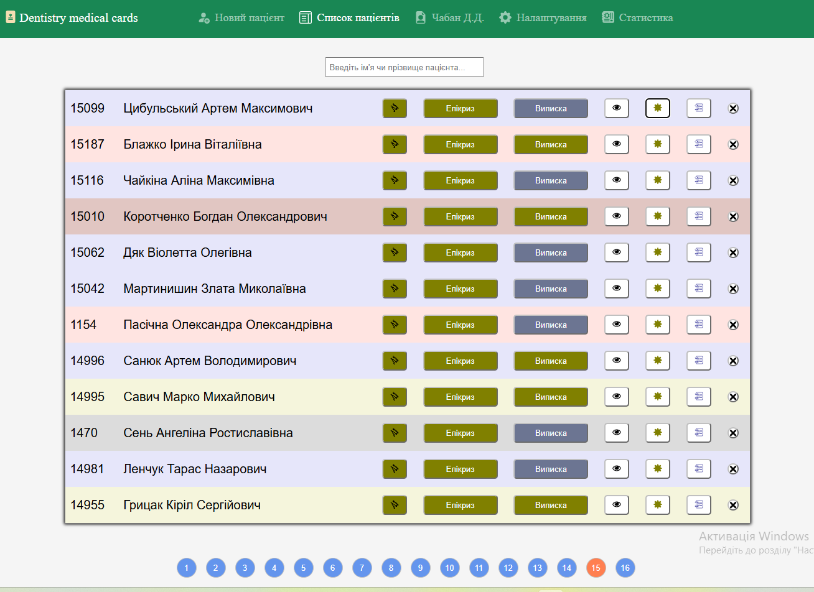
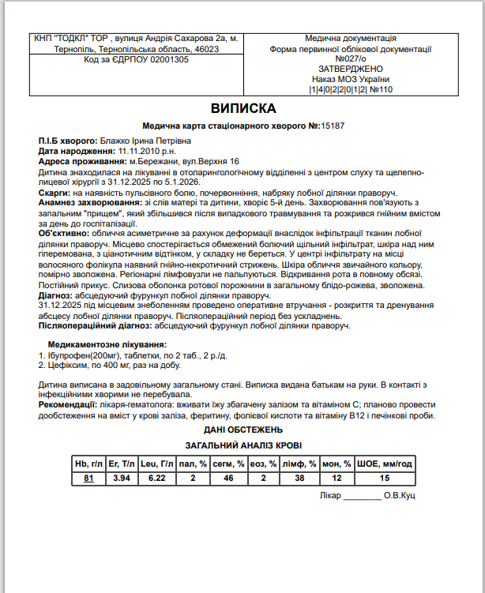

# 🦷 Dentistry Medical Card (OMS Management System)

[](https://olehkuts.github.io/Dentistry_medical_card/)

A specialized medical ERP system designed for Oral and Maxillofacial Surgery departments. This application automates the generation of complex medical documentation, reducing paperwork time for surgeons. It has been successfully deployed and used in a clinical environment for several years.

## 🚀 Live Demo

Experience the application here: [https://github.io](https://olehkuts.github.io/Dentistry_medical_card/)

## 📸 Screenshots

|            Primary Patient Form            |           Patient Management List           |
| :----------------------------------------: | :-----------------------------------------: |
|  |  |

|           Document Generation Example            |
| :----------------------------------------------: |
|  |

## ✨ Key Features

- **Automated Document Generation:** Generates comprehensive 6-12 page inpatient medical records based on diagnostic and clinical data.
- **Medical Logic Modules:** Specialized forms for surgical protocols, daily check-up diaries, discharge summaries, and epicrisis.
- **Privacy & Offline-First:** Uses `LocalStorage` for data persistence, ensuring that sensitive patient data stays on the user's machine.
- **Data Portability:** Full Import/Export functionality via JSON files for archiving yearly records or migrating data.
- **Statistics & Analytics:** Track treatment volumes for individual doctors within the department.
- **Print-Ready Output:** Formats documents specifically for physical printing with editing capabilities prior to output.

## 🛠 Tech Stack

- **Frontend:** React (Functional Components)
- **State Management:** `useReducer` with `Context API` for complex business logic.
- **Routing:** React Router v7.
- **Styling:** SASS, React Bootstrap.
- **Icons:** React-bootstrap-icons.
- **Architecture:** Extensive use of **Custom Hooks** for modular logic and LocalStorage synchronization.
- **Utilities:** UUID for unique record tracking.

## 📁 Application Structure

1.  **New Patient:** High-density form for initial examination, anamnesis, and objective status.
2.  **Patient List:** Central dashboard with pagination (12 records/page) to manage clinical records.
3.  **Medical Card:** The preview engine where generated documents are finalized and printed.
4.  **Settings:** Configurable clinical data (clinic name, department, medical staff names).
5.  **Statistics:** Visual data regarding treated cases per physician.

## ⚙️ Local Development

1. **Clone the repository:**
   ```bash
   git clone https://github.com
   ```
2. **Install dependencies:**
   ```bash
   npm install
   ```
3. **Start the development server:**
   ```bash
   npm start
   ```

---

_Developed by [Oleh Kuts](https://github.com/OlehKuts)_
